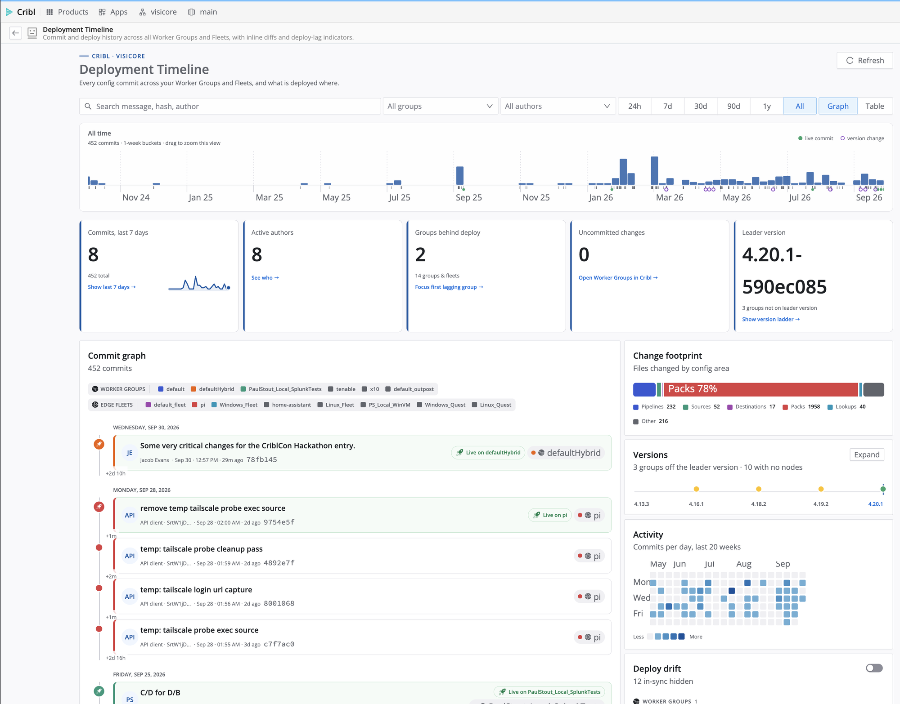

# Deployment Timeline

## About This App

Cribl keeps a Git history of every configuration change, but the built-in view shows one Worker Group at a time and
gives no picture of the gap between what is committed and what is running. Deployment Timeline reads that history for
every Worker Group and Edge Fleet at once and shows it on one time axis, with the same deploy, revert, and commit
actions as Cribl's own commit view.

Built for the CriblCon 2026 App Hackathon on the Cribl App framework and the Capra design system. Supported products:
Cribl Stream Worker Groups and Cribl Edge Fleets on Cribl.Cloud, Cribl 4.20.0 or later.

## What It Shows

<!-- markdownlint-disable MD013 -->
| View | What it shows |
| --- | --- |
| **Time scale** | A real time axis with commit counts in adaptive buckets, from weeks down to the minute. The toolbar time range sets what it shows; drag across it to zoom this view down to the minute, double-click or Reset zoom to widen. Live commits and version changes are marked under the axis. |
| **Commit timeline** | One vertical spine, newest first, with a card per commit: message, author, date and time, hash, the groups it belongs to, and a green "Live on" marker when that commit is what a group is running. The time gap to the previous commit is printed on the spine. |
| **Stat tiles** | Commits in the last 7 days with a 30-day sparkline, active authors, groups behind deploy, uncommitted changes, and the Leader's software version. |
| **Change footprint** | Changed files by config area: pipelines, routes, sources, destinations, packs, lookups. |
| **Versions** | A compact ladder of every group's running Cribl version against the Leader. Expand it for the full ladder with mixed-version spans, upgrade targets, and incompatible-node counts. |
| **Activity** | Commits per day for the last 20 weeks. |
| **Deploy drift** | One row per group: how many commits it is behind its deployed version, uncommitted changes, and the version its nodes run. In-sync groups are hidden until you switch them on. |
| **Who touches what** | Heatmap of files changed per group and config area, with a Leader row for shared files. Quiet groups are hidden until you switch them on. |
| **Authors** | Commits per author, with you highlighted. |
| **Commit drawer** | Full message, changed files, a color-coded diff, and the Deploy and Revert buttons. |
<!-- markdownlint-enable MD013 -->

Worker Groups and Edge Fleets are always listed in separate sections. Every value is clickable: tiles, names, chips,
cells, and segments either set a filter or open the matching Cribl screen in a new tab.

## Installation

1. Install from the Cribl Marketplace, or download the `.tgz` from the
   [latest release](https://github.com/Cribl-Community/cc-jevans/releases/latest) and use
   **Apps → Add App → Import from File**.
2. Review the permissions shown at install (listed below), then share the app with the users or teams who should
   see it.
3. Open it from the **Apps** menu. It loads live data immediately; there are no settings.

## Usage

### Read the history

1. Pick a time range in the toolbar (24h to All). Every panel follows it. Drag across the time scale to zoom that
   view down to a day, an hour, or a few minutes without changing the rest of the page.
2. Narrow further with search, group, author, or by clicking any tile, chip, name, calendar day, heatmap cell, or
   chart segment.
3. Click a commit card to open the drawer with its changed files and diff.

### Act on a commit

- **Deploy to** and **Revert this commit** sit at the top of the drawer. Each shows a confirmation naming the exact
  commit and group before anything runs, and a toast reports the result.
- When a group has uncommitted changes, a **Commit N** button appears on its Deploy drift row.
- Nothing runs automatically. The app never deploys, reverts, or commits on load or on a timer.

Filters and switches are remembered per user in the app's KV store.

## Requirements

- Cribl.Cloud with Apps enabled, Cribl 4.20.0 or later.
- Read access to Worker Groups and version history for everyone who uses the app. Deploy, revert, and commit
  additionally need write permission on the target group; the app cannot grant more than the signed-in member's role
  allows.
- No external systems, credentials, or configuration.

## Permissions and Data

All access is declared in `config/policies.yml` and reviewed by the admin at install.

<!-- markdownlint-disable MD013 -->
| Method | Path | Used for |
| --- | --- | --- |
| GET | `/master/groups`, `/master/groups/*` | Group and Fleet inventory, deployed version |
| GET | `/m/:gid/version`, `/m/:gid/version/*` | Commit history, changed files, diffs |
| GET | `/system/info` | Leader version |
| GET | `/master/workers` | Cribl version each connected node runs |
| PATCH | `/master/groups/:id/deploy` | Deploy a commit to a group (after confirmation) |
| POST | `/m/:gid/version/revert` | Create an inverse commit (after confirmation) |
| POST | `/m/:gid/version/commit` | Commit a group's pending changes (after confirmation) |
<!-- markdownlint-enable MD013 -->

No external hosts; `config/proxies.yml` is empty. The app never handles authentication tokens; the Cribl platform
proxies every call with the signed-in member's identity. Nothing leaves the Cribl platform. Persistent storage is one KV
key per user, `ui/filters`. Uninstalling the app removes its KV store.

## Troubleshooting

- **Error banner on open:** the signed-in user lacks read access to a group, or Apps are disabled under Settings →
  Global Settings → App Settings.
- **Deploy or Revert fails:** the user's role lacks write access to that group. Nothing is changed when this happens.
- **Works in Live Preview but not when installed:** an API path was added without a matching entry in
  `config/policies.yml`.
- **Links into Cribl screens do nothing in Live Preview:** they resolve against the Leader UI and only work in the
  installed app.
- Cribl records each group's current deployed version, not deploy events, so the timeline marks what is live now rather
  than when earlier deploys happened. The per-group commit log is capped at the most recent 200 commits. Version rows
  need at least one connected node. "Version change" tags are a heuristic on the commit message.

## Author

VisiCore Tech - <CriblPacks@VisiCoreTech.com>

## Release Notes

- Version 1.0.0 - 2026-09-30
  - Initial release: time scale, commit timeline, stat tiles, change footprint, versions ladder, activity calendar, deploy
    drift, who-touches-what heatmap, authors, commit drawer with diff, and deploy, revert, and commit actions.

## Contributing to the App

To contribute to this App, or to report any issues or enhancement requests, please connect with **VisiCore Tech** on
[Cribl Community Slack](https://cribl-community.slack.com) or email us at: <CriblPacks@visicoretech.com>.

Development: `npm install`, `npm run dev` for Live Preview, `npm test`, `npm run lint`, `npm run package`. Tagging
`vX.Y.Z` on `main` cuts a release with the packaged `.tgz` attached. Built with Claude Code; every generated change was
reviewed, linted, and tested before commit.

## License

This App uses the following license: [Apache 2.0](LICENSE).
